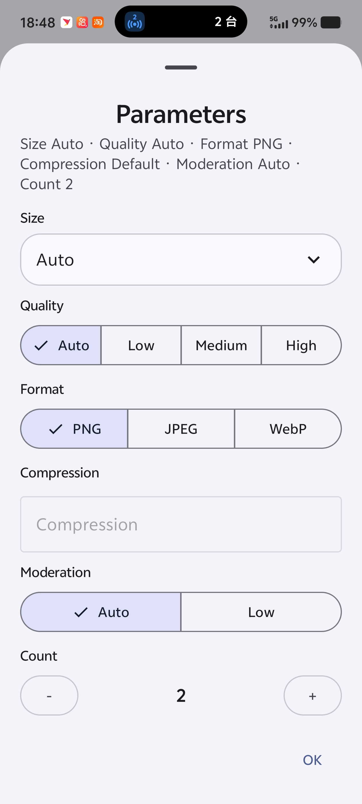
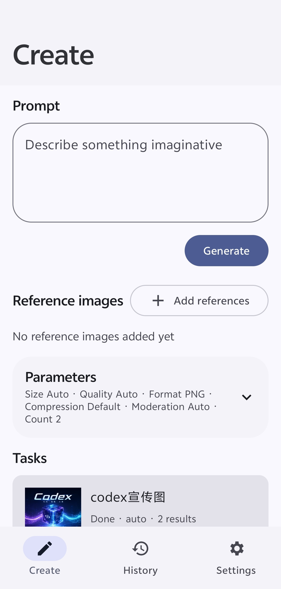

# Image2 Android

English | [简体中文](translations/README-zh_Hans.md) | [繁體中文](translations/README-zh_Hant.md)

Android image generation app for GPT Image and compatible relay APIs.

[Download releases](https://github.com/shj56166/image2-android/releases)

<p>
  
  
</p>

## Features

- Text-to-image and image-reference generation
- Size, quality, format, compression, moderation, and count options
- Task history and result preview
- Local API profile storage
- Simplified Chinese, Traditional Chinese, and English

## Build

Requirements:

- JDK 17
- Android SDK API 35

```powershell
.\gradlew.bat clean test assembleRelease
```

Package name:

```text
com.shj56166androidimage2.app
```

## Tech Stack

- Kotlin and Gradle Kotlin DSL
- Jetpack Compose with Material 3
- AndroidX Lifecycle, DataStore, Security Crypto, WorkManager
- Room database with KSP
- OkHttp, Retrofit, kotlinx.serialization
- Coil for image loading

## Architecture

- `ui`: Compose screens, app root, theme, and view models
- `data`: Room entities and DAO, repositories, network models, provider mapping, local storage
- `domain`: image execution engine contract
- `worker`: background image task execution
- `util`: app language and locale helpers

The app keeps API profiles, task records, sessions, drafts, and generated image metadata on the device. Network execution is routed through an image engine that supports OpenAI-compatible `/responses`, `/images/generations`, `/images/edits`, fal.ai-style endpoints, and custom provider mappings.

## License

MIT

## Reference

Inspired by [CookSleep/gpt_image_playground](https://github.com/CookSleep/gpt_image_playground).
