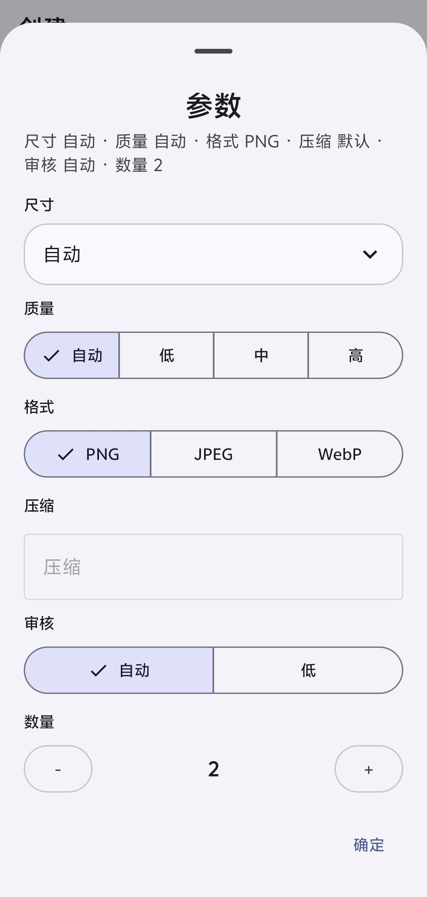

# Image2生图 Android

[English](../README.md) | 简体中文 | [繁體中文](README-zh_Hant.md)

Android 生图应用，适用于 GPT Image 与兼容中转 API。

[下载发布版](https://github.com/shj56166/image2-android/releases)

<p>
  
  
</p>

## 功能

- 文生图与参考图生图
- 尺寸、质量、格式、压缩、审核、数量参数
- 任务历史与结果预览
- API 配置本地保存
- 简体中文、繁體中文、English

## 构建

要求：

- JDK 17
- Android SDK API 35

```powershell
.\gradlew.bat clean test assembleRelease
```

包名：

```text
com.shj56166androidimage2.app
```

## 技术栈

- Kotlin 与 Gradle Kotlin DSL
- Jetpack Compose 与 Material 3
- AndroidX Lifecycle、DataStore、Security Crypto、WorkManager
- Room 数据库与 KSP
- OkHttp、Retrofit、kotlinx.serialization
- Coil 图片加载

## 主要架构

- `ui`：Compose 页面、应用根组件、主题、ViewModel
- `data`：Room 实体与 DAO、Repository、网络模型、服务商映射、本地存储
- `domain`：生图执行引擎接口
- `worker`：后台生图任务执行
- `util`：应用语言与区域设置辅助

应用在设备本地保存 API 配置、任务记录、会话、草稿和生成图片元数据。网络请求由生图执行引擎统一处理，支持 OpenAI 兼容的 `/responses`、`/images/generations`、`/images/edits`，fal.ai 风格接口，以及自定义服务商映射。

## 开源协议

MIT

## 借鉴

Inspired by [CookSleep/gpt_image_playground](https://github.com/CookSleep/gpt_image_playground).
